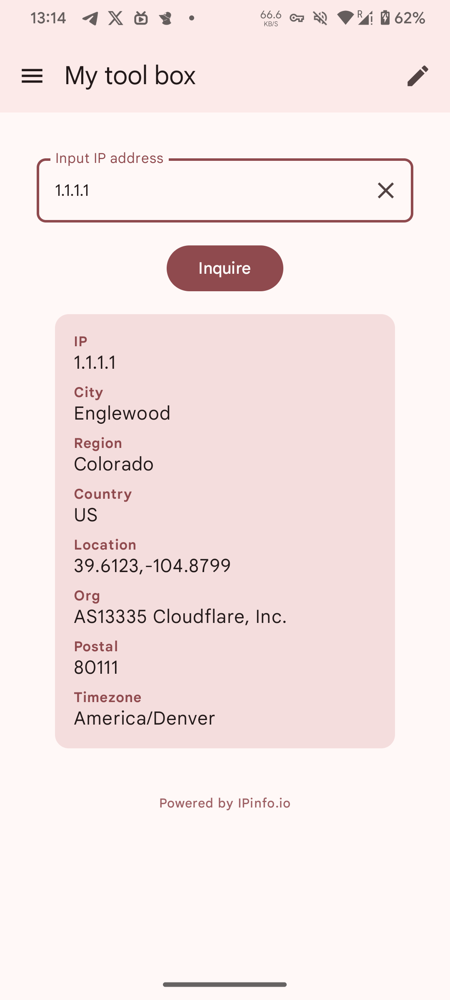

# Android Tool Box

This is my Android tool box.

## Technologies Used

- **Jetpack Compose**: For building native UI.
- **Material3**: For modern design components.
- **Retrofit**: For network requests.
- **Navigation**: For in-app navigation.

## Features

